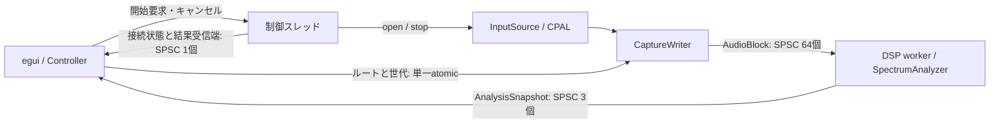

# アーキテクチャ再設計（2026-09-10）

## 要件の再構成

根拠は README.md、onboarding_guide.md、REVIEW_PLAN.md、および既存ソース・テスト。
開始時の未コミット変更も現在の仕様として保持する。将来機能を必須機能と混同しない。

| 要件 | 設計上の保証 / 検証 |
| --- | --- |
| DAWから独立したWindows入力。ASIO優先、WASAPI共有モードへフォールバック | CPALアダプターにホスト選択を局所化。実機テストは任意実行 |
| 同一ストリームのReference/Measurement同期、任意ルーティング、モノラル | CaptureWriterがペア・時刻・世代をまとめて配送 |
| コールバックで確保・ロック・待機をしない | 固定長ブロックと容量制限SPSC。溢れはブロック単位の欠落 |
| UI負荷が入力・DSPを停止させない | データ経路は2本のSPSC、制御メッセージから独立 |
| 2048 FFT、50%重複、Hann補正、dBFS、H1、位相、coherence | 既存DSP数式と合成信号テストを保持 |
| 欠落・切替後に古い平均・画面を混ぜない | DSPで連続性検査、結果受信でルート世代検査、接続ごとに新しいキュー |
| スペクトラム・メーター・スコープ・履歴・HOLD | 既存描画を保持。セッション切替で表示状態を初期化 |
| 失敗が診断でき、確実に終了する | 接続状態を明示。入力停止→DSP終了。開始途中のキャンセルに対応 |

追加する基盤要件: 入力がなくてもUIを開けること、再接続できること、解析と実行制御をハードウェアなしで検証できること。
FFT可変化、信号出力、複数デバイス同期、ドリフト補正、位相アンラップは今回の範囲外。

## 比較と決定

| 案 | 利点 | 不利な点 | 適合度 |
| --- | --- | --- | --- |
| A: 現行3コンテキストをモジュール整理 | 変更量が少なく、遅延特性を維持 | デバイス所有・起動・UIの結合が残り、障害復旧と結合試験が難しい | 中 |
| B: Ports & Adapters + 制御専用スレッド | DSPと入力を独立検証できる。UI非同期起動・再接続。リアルタイム経路を維持 | 所有権と接続状態の設計が必要。制御スレッドが1本増える | **高・採用** |
| C: 非同期ランタイム上の全面アクター構成 | 多数のネットワーク入力等には拡張しやすい | CPAL callbackは別実行系のまま。新依存とスケジューラが増え、本要件への便益が小さい | 低 |

Bを単一crate内の境界とCargo featureで実装する。現規模では多crate workspaceや独自プラグインABIは不要。
既存の正しい数式・視覚表現は再利用し、依存方向と所有権を要件から組み直す。

## 構成と所有権



- `model`: 固定長の入出力データ、ルート、不変条件。
- `capture`: サンプル型に依存しないコールバック処理。入力ペア化、ブロック化、欠落計測。
- `source`: 入力ポート `InputSource`、接続メタデータ、RAIIの入力セッション。CPAL/GUIへの依存なし。
- `audio`: CPALアダプターだけを担当。サンプル変換、ホスト選択、開始時受信確認。
- `dsp`: スレッド・デバイス・UIを知らない解析コア。
- `pipeline`: 入力とDSPの組立・終了、結果受信端。同期APIはCLI/実機試験にも利用可能。
- `controller`: UI用の接続状態機械。ブロックし得るopen/stop/joinは制御スレッドで実行。
- `ui`: 接続状態と解析結果を描画。デバイスとDSPスレッドを直接所有しない。

入力ストリームは開いた制御スレッドに留まり、`Send`を要求しない。入力ファクトリーだけをスレッドへ渡す。
結果受信端を接続成功イベントでUIへ一度移すため、解析結果を制御スレッドで中継・コピーしない。
接続ごとにキュー・統計・ルート世代を作り直す。旧セッションの受信端は停止要求時に破棄する。

## 容量、失敗、終了

- 音声キュー: 64 × 256フレーム。満杯時にペアを含むブロック全体を破棄。フレーム番号は進める。
- 結果キュー: 3個 + DSP内pending 1個。最新pendingによる上書きは計数し、入力停止後も再送する。
- 制御: 開始要求1個、状態イベント1個 + pending 1個。音声コールバックから制御チャネルを使用しない。
- 開始要求と状態イベントもSPSCを使用。結果を読むUI側のループは、読み出し開始時のキュー件数で打ち切る。
- 状態: Stopped → Starting → Running / Failed、Starting / Running → Stopping → Stopped。失敗・停止から再試行可能。
- キャンセル: 入力到着待ちとホスト切替で確認。CPAL/ドライバー内部の呼び出しは強制中断できない。
- 正常終了: 入力を停止してからDSPに終了要求、join。UI実行中の停止は非同期、アプリ終了時には制御スレッドをjoin。
- 実行中に入力が途絶えた場合は既存の鮮度表示で検出し、停止・再接続を利用する。自動のホスト切替は開始時だけ。

## ビルド境界と検証方針

- デフォルト: `desktop + asio`。既存のWindows動作を維持。
- `--no-default-features`: 解析・キャプチャ・実行制御のみ。CPAL/egui/ASIO SDKは不要。
- `--no-default-features --features desktop`: WindowsではWASAPIでGUIをビルド可能。
- 既存DSP回帰試験に加え、入力飽和、切替、キャンセル、失敗後再試行、停止・再接続、実経路での合成信号解析を試験する。
- 実機の48/96/192kHz、ASIO/WASAPIドライバー、ネイティブ画面の目視は、合成テストやヘッドレス描画とは区別して報告する。

## 実装と検証結果

実装開始前に `codex/architecture-redesign` を作成。開始時の未コミット変更を引き継いだ。
解析数式・UI履歴状態・テーマは開始時と同一内容であることも確認した。

| 検証 | 結果 |
| --- | --- |
| `cargo test --locked` | 通常42テスト成功、実機1件は通常ignore |
| `cargo test --release --locked` | 通常42テスト成功 |
| `cargo test --locked --no-default-features` | コア31テスト成功 |
| `cargo test --locked --no-default-features --features desktop` | ASIOなし構成42テスト成功 |
| `cargo clippy --locked --all-targets --all-features -- -D warnings` | 成功 |
| コアのみのClippy / `cargo fmt --check` / `git diff --check` | 成功 |
| `cargo build --release --locked` | 成功 |
| 明示実行の `live_audio` | MOTU M Series / ASIO / 96kHz / 6chで成功 |

実機試験は制御スレッド上のCPAL起動→入力受信→Reference無効化・復元→停止→再接続→終了を通した。音声ファイルの保存は行わない。
合成入力では48/96/192kHzの実パイプライン、キュー飽和、ルート変更、失敗後再試行、開始中キャンセル、未読接続イベントを残した停止を検証した。
カスタムアロケーターによる計測では、初期化後128ブロックの入力処理（キュー飽和を含む）とFFT処理の確保回数は0だった。
UIは未接続・失敗状態を760×640 / 1440×900でヘッドレス描画した。

初回ビルドでは既存一時ディレクトリのASIO SDKにヘッダーが欠落していたため、[Steinberg公式SDK](https://www.steinberg.net/asiosdk) を `target/asio-sdk/ASIOSDK` に展開して検証した。SDKはGit管理に含めない。この作業環境でASIOビルドを再現する場合:

```powershell
$env:CPAL_ASIO_DIR = (Resolve-Path target/asio-sdk/ASIOSDK).Path
$env:LIBCLANG_PATH = 'C:\Program Files\LLVM\bin'
cargo test --locked
```

実機48/192kHz、WASAPI実入力、旧Realtekドライバーの再検証、長時間の負荷・遅延測定、ネイティブウィンドウの目視は未実施。リモートCIは設定を追加したが未実行。
